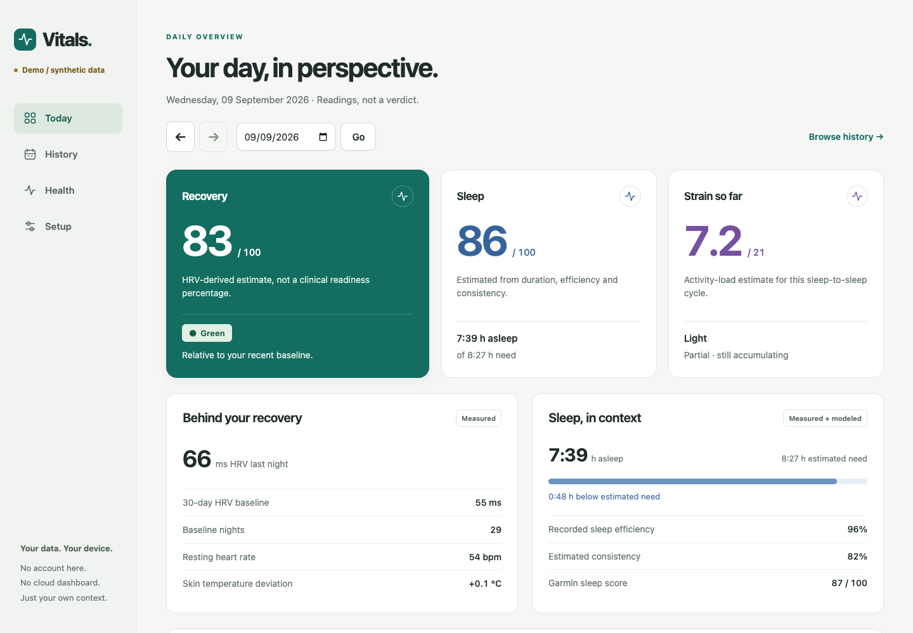

# Vitals

**Your Garmin data. A clearer daily picture.**

Local-first recovery, sleep and strain, with browsable history and longer-term health metrics. Run it on your own computer; inspect or change the Python formulas. No hosted account, dashboard subscription, JavaScript framework or build step.

> Independent, experimental software. Not affiliated with Garmin or WHOOP. These estimates are not medical advice, a diagnosis, or clearance to train.

## Try it without an account

Install [uv](https://docs.astral.sh/uv/getting-started/installation/), then:

```sh
git clone https://github.com/gzaripov/garmin-vitals.git
cd garmin-vitals
uv run app.py --demo
```

Open **http://localhost:8767**. Demo mode generates synthetic source data, runs the real metric formulas, and labels every page **Demo**. It ignores your personal configuration and never reads your Garmin tokens or health records. No Garmin account is needed.

The dashboard also runs with Python 3.11+: `python app.py --demo`. Only the optional Garmin sync command needs a third-party dependency; it requires Python 3.12+, which uv selects from the script's metadata.



## Use your own Garmin data

```sh
# First import: enough history for a baseline and longer-term comparisons.
uv run sync.py --days 180

# Run the local dashboard.
uv run app.py
```

The sync command prompts for Garmin credentials in your terminal and supports the authentication flow provided by [python-garminconnect](https://github.com/cyberjunky/python-garminconnect). Credentials are not collected by the web UI. Session tokens and normalized data stay in the private local data directory; neither belongs in Git.

Refresh after syncing your watch with Garmin Connect:

```sh
uv run sync.py --days 7
```

Short syncs merge into existing history rather than replacing it. Some devices do not expose every field, and Garmin's unofficial API may change or reject requests. Missing readings remain missing; an absent sensor is not a zero. The first import makes many requests and takes longer than a daily refresh.

Run `uv run sync.py --help` for date and token-directory options. An existing token directory can be used explicitly; older SDK token stores may require a fresh sign-in. The importer does not silently borrow another application's login.

### What you will see

- **Today:** recovery context, sleep against estimated need, strain including open cycles, and recent trends.
- **History:** a visible month calendar and dated readings. Select a day to see its own historical context.
- **Health:** nine longer-term inputs, recent versus baseline values, coverage and missing measurements. Experimental modeled-age information is secondary.
- **Setup:** local setup instructions and data-source information.

Recovery needs at least 14 valid prior HRV nights within a 30-day baseline. A sparse baseline produces no recovery estimate, not a bad score. Sleep scoring needs consecutive bedtime/wake-time observations. Long-term averages are less representative with short or incomplete histories; the interface shows coverage.

## Configuration

No configuration is needed for demo mode or the default `./data` folder. To configure a real installation, create **`settings.json`** beside `app.py` (already gitignored):

```json
{
  "data_dir": "/absolute/path/to/private/garmin-data",
  "age": 34,
  "health_gain": 1.0
}
```

Age is optional and must be your own chronological age. Without it, the app can still show raw metrics but does not invent an absolute modeled age. Update it yourself over time. `health_gain` defaults to `1.0`; it is an experimental calibration parameter, not a clinically validated adjustment.

Environment overrides: `VITALS_DATA_DIR`, `VITALS_AGE`, `VITALS_HEALTH_GAIN`. Relative data paths resolve from the project directory; use an absolute path when sharing data between tools.

An existing installation with a separately maintained recovery protocol can explicitly set `HEALTH_DIR` (or `health_dir` in settings) to that directory. It must contain `garmin_recovery.py`; its `readiness()` remains authoritative. This integration is **optional**. A fresh clone has its own bundled recovery implementation and never searches your home directory for another repository.

## Build your own metrics

The web server is optional. The model modules use Python's standard library:

```python
from scores import series
from recovery import readiness
from healthspan import report

history = series()                    # {"YYYY-MM-DD": daily metrics}
if history:
    day = max(history)
    print(history[day]["sleep_score"])
    print(history[day].get("strain"))
    print(readiness(day))

print(report(180))                    # raw inputs, coverage, experimental model
```

`series(days=14)` returns recent rows **after** computing their historical sleep debt and strain context. It must give the same values as those dates in the full series.

### Normalized data contract

Bring your own exporter instead of using Garmin authentication. Point `VITALS_DATA_DIR` at a folder containing these UTF-8 JSON objects. Missing measurements should be omitted or `null`, not fabricated as zero.

| File | Keys | Fields used by the models |
|---|---|---|
| `garmin_hrv_resp.json` | ISO day → record | `hrv_last_night` (ms), `sleep_sec`, `sleep_awake_sec`, `nap_sec`, `skin_temp_dev_c`, `rhr` (bpm), `steps`, `kcal_active`, optional Garmin `sleep_score` |
| `garmin_intraday.json` | ISO sleep-end day → record | `sleep_start_gmt`, `sleep_start_local`, `sleep_end_local` (epoch milliseconds) |
| `garmin_activities.json` | activity ID → record | `startTimeGMT`, `startTimeLocal` (ISO timestamps), `activityTrainingLoad`, `maxHR`, `duration` (seconds), `type`, `hrTimeInZone_1` … `hrTimeInZone_5` (seconds) |
| `garmin_healthspan.json` | ISO day → record | `vo2max` (ml/kg/min), `body_fat_pct`, `activities_synced` (boolean coverage marker) |

Garmin `*TimestampLocal` values encode **wall-clock time as epoch milliseconds**, not a UTC instant to convert to your timezone. GMT fields represent UTC. Keep these distinct or bedtime consistency and activity-cycle assignment will drift.

Set `activities_synced: true` only after fetching a calendar day's complete activity list, including genuinely empty lists. Movement rates use covered days; an empty file without coverage is not evidence of zero exercise. Strain cycles crossing two dates need both dates covered. Existing explicitly configured `HEALTH_DIR` full exports retain their original coverage convention.

For example, a partial daily record is valid:

```json
{
  "2026-01-15": {
    "hrv_last_night": 55,
    "sleep_sec": 27000,
    "sleep_awake_sec": 1200,
    "steps": 8000
  }
}
```

This isolated synthetic record is not enough for a recovery baseline or a sleep consistency score. Missing output is expected until the necessary history is available. `demo.py` is a complete synthetic example of all four files.

### Where to change things

| File | Responsibility |
|---|---|
| `scores.py` | sleep need, sleep consistency, sleep score and day strain |
| `recovery.py` | baseline-relative HRV readiness, explicit abstention and overrides |
| `healthspan.py` | longer-term inputs and experimental cohort-derived contributions |
| `sync.py` | optional Garmin authentication, normalization and private merged writes |
| `demo.py` | synthetic source data, never an export of real readings |
| `config.py` | explicit local settings and data paths |
| `app.py`, `static/style.css` | server-rendered interface |
| `backtest.py` | compare estimates against your own private WHOOP API export |

## What the numbers mean—and do not mean

Sleep and strain coefficients were fitted against **one person's** WHOOP export. Previously observed agreement was approximately **3.5 points mean absolute error for sleep** and **1.3 for strain on jointly worn days**. These are historical, single-person comparisons—not performance guarantees, clinical validation, or results you can reproduce without the original private dataset. No private exports are distributed.

- Recovery describes HRV relative to a recent personal baseline, with explicit sleep/temperature overrides. It cannot rule out illness or decide whether training is safe.
- Sleep need is a heuristic with accumulated debt and recent strain. Sleep consistency and wake-time estimates depend on your device's data quality.
- Strain is a 0–21 estimate from training load and active calories, not Garmin's own branded metric. An open cycle is labeled separately from a finished day.
- The Health model combines correlated, population-level associations. Its references are not personalized medical targets. Modeled years and comparisons of 30-day versus six-month windows are **not** measured biological age or a literal rate of aging.

The source retains formulas and study citations so assumptions can be inspected. Contributions improving generalizability, missing-data handling and device coverage are especially useful.

`backtest.py` accepts a private `whoop.json` with `cycles` and `sleep` arrays from the WHOOP API. It is not an importer for every CSV export format.

## On your phone

On a trusted private network, run `uv run app.py --lan` and open your computer's LAN address on port 8767 from your phone. Use your browser's **Add to Home Screen** option for a dedicated Vitals shortcut. The server must remain running; this does not upload data or create an offline copy. LAN mode has no authentication—see the warning below.

## Privacy and network access

- The server binds to **127.0.0.1** by default. The web interface has **no authentication**.
- `--lan` binds on all interfaces. Use it only on a trusted private network; it exposes your readings to reachable clients. Do not port-forward it or expose it through a public tunnel.
- The dashboard uses local assets. No analytics, external font requests, hosted database or dashboard account.
- `sync.py` contacts Garmin to fetch your data. Installing uv or the optional dependency contacts the respective package hosts.
- `data/`, `settings.json`, token directories and environment files are ignored by Git. If using a custom data path, keep it outside the public repository too.
- Screenshots in this repository use synthetic demo data. Do not post real readings, logs, tokens or exports in issues unless you intentionally want them public.

## Contribute

```sh
python -m unittest discover -v
python app.py --demo
```

Keep the dashboard dependency-free. Check changes in both a phone-sized and desktop browser. New metrics should document their units, time window, missing-data behavior and evidence—not just add another number.

Open an issue with the device model, a description of the behavior and a **redacted or synthetic** reproduction. Never attach account tokens or unredacted Garmin responses.

MIT licensed. Garmin and WHOOP trademarks belong to their respective owners.
